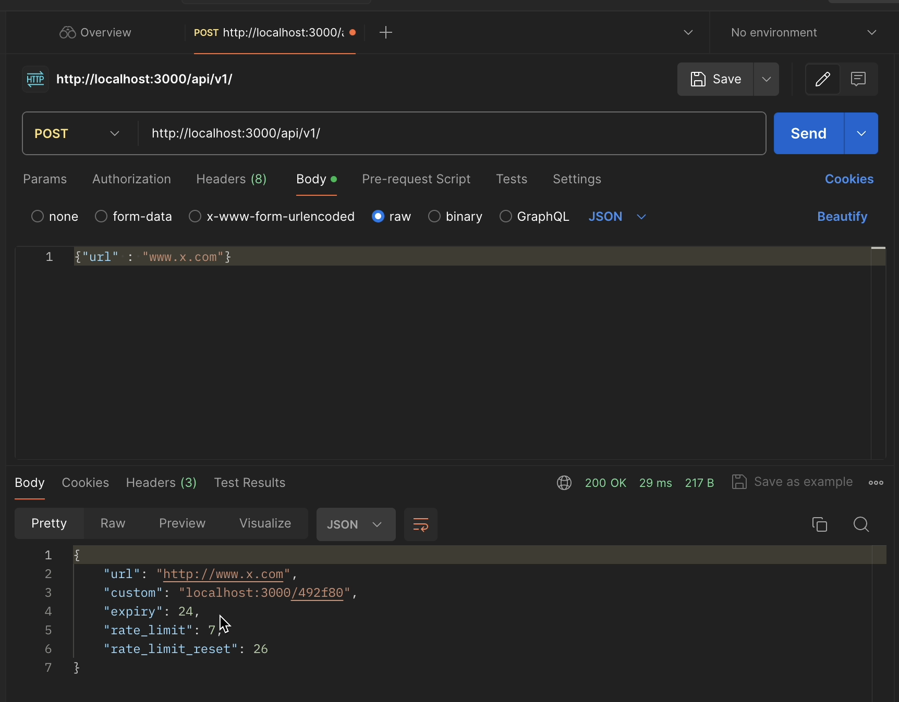
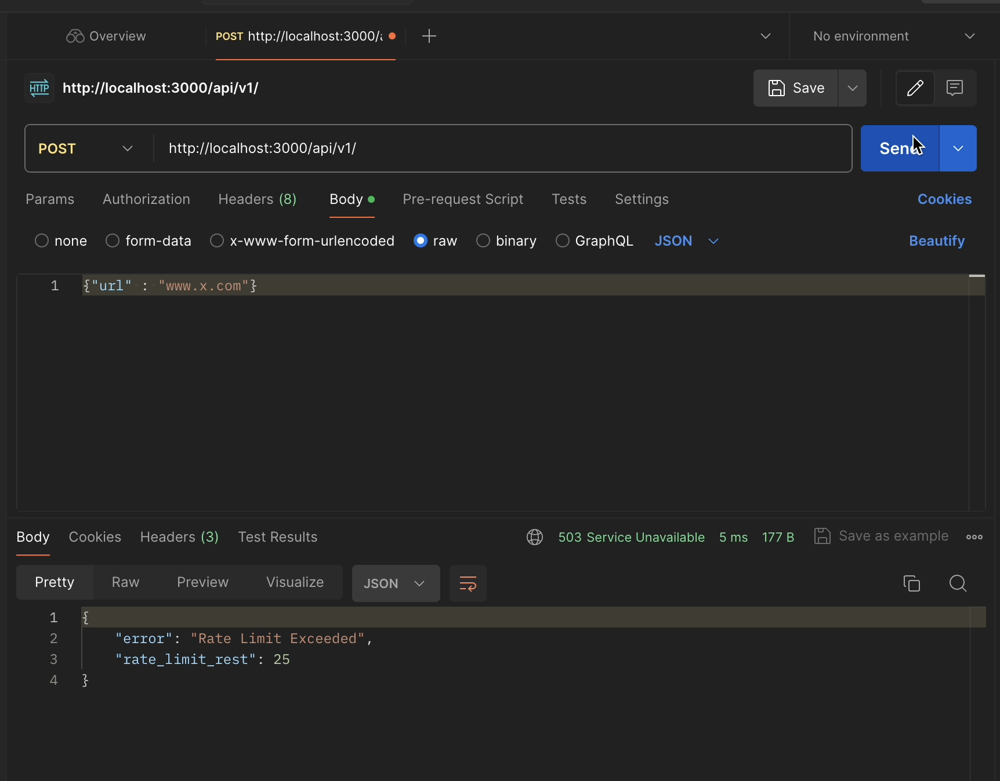
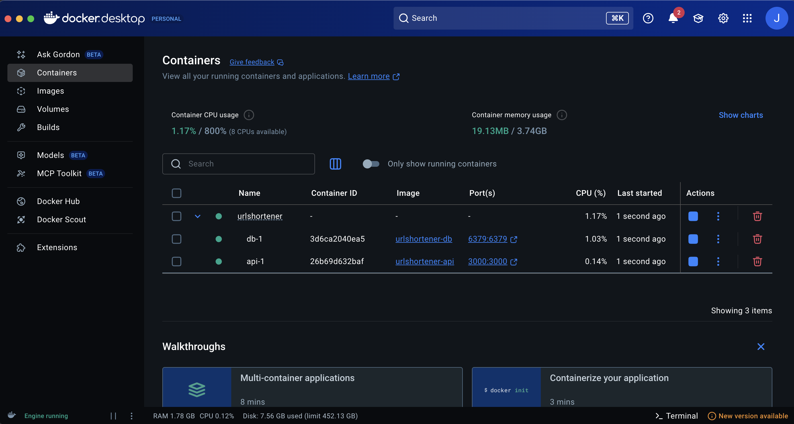

# 🔗 URL Shortener

A high-performance URL shortener service built with Go, Fiber, Redis, and Docker. This service provides fast URL shortening with custom aliases, rate limiting, and expiration features.

<!-- ## 🎥 Demo -->

<!-- **📹 Demo Video:** [Watch on YouTube](https://youtu.be/GqHmJgdy0VI) -->

## 📸 Screenshots

### API Response Example

*Example of successful URL shortening API response with rate limiting information*

### Rate Limiting in Action

*Rate limiting response when quota is exceeded*

### Docker Containers Running

*URL Shortener service running with Docker Compose - API and Redis containers*

## ✨ Features

- **Fast URL Shortening**: Generate short URLs with custom or auto-generated IDs
- **Custom Aliases**: Support for custom short URL aliases
- **Rate Limiting**: IP-based rate limiting with configurable quotas
- **URL Expiration**: Configurable expiration times for shortened URLs
- **URL Validation**: Validates URLs and prevents domain loops
- **Redis Storage**: Fast Redis-based storage with persistence
- **Docker Support**: Full containerization with Docker Compose
- **RESTful API**: Clean REST API with JSON responses
- **Request Logging**: Built-in request logging middleware

## 🛠️ Tech Stack

- **Backend**: Go 1.16+
- **Web Framework**: [Fiber v2](https://gofiber.io/) - Express-inspired web framework
- **Database**: [Redis](https://redis.io/) - In-memory data store
- **Containerization**: Docker & Docker Compose
- **Dependencies**:
  - `gofiber/fiber/v2` - Web framework
  - `go-redis/redis/v8` - Redis client
  - `google/uuid` - UUID generation
  - `asaskevich/govalidator` - URL validation
  - `joho/godotenv` - Environment variable management

## 🚀 Quick Start

### Prerequisites

- Docker & Docker Compose
- Git

### Installation & Setup

1. **Clone the repository**
   ```bash
   git clone https://github.com/jay-agg/urlshortener.git
   cd urlshortener
   ```

2. **Set up environment variables**
   ```bash
   # Create .env file in the api directory
   cp api/.env.example api/.env
   
   # Edit the .env file with your configuration
   nano api/.env
   ```

3. **Run with Docker Compose**
   ```bash
   docker-compose up --build
   ```

4. **Access the service**
   - API: `http://localhost:3000`
   - Redis: `localhost:6379`

## ⚙️ Configuration

Create a `.env` file in the `api` directory:

```env
# Server Configuration
APP_PORT=:3000
DOMAIN=localhost:3000

# Redis Configuration
DB_ADDR=db:6379
DB_PASS=

# Rate Limiting
API_QUOTA=10
```

## 📖 API Documentation

### Shorten URL

**POST** `/api/v1`

Shorten a long URL with optional custom alias and expiration.

**Request Body:**
```json
{
  "url": "https://example.com/very/long/url",
  "custom": "my-alias",
  "expiry": 24
}
```

**Response:**
```json
{
  "url": "https://example.com/very/long/url",
  "custom": "localhost:3000/my-alias",
  "expiry": 24,
  "rate_limit": 9,
  "rate_limit_reset": 30
}
```

**Parameters:**
- `url` (required): The URL to shorten
- `custom` (optional): Custom alias for the short URL
- `expiry` (optional): Expiration time in hours (default: 24)

### Resolve Short URL

**GET** `/:url`

Redirect to the original URL using the short code.

**Example:**
```bash
curl -L http://localhost:3000/my-alias
# Redirects to the original URL
```

## 🐳 Docker Architecture

The application uses a multi-stage Docker setup:

### API Container (`api/`)
- **Base Image**: `golang:alpine` (builder) → `alpine` (runtime)
- **Port**: 3000
- **Features**: Multi-stage build for optimized image size

### Redis Container (`db/`)
- **Base Image**: `redis:alpine`
- **Port**: 6379
- **Persistence**: Data volume mounted to `./data`

### Docker Compose Services
```yaml
services:
  api:      # Go Fiber application
  db:       # Redis database
```

## 🔧 Development

### Local Development (without Docker)

1. **Install Go dependencies**
   ```bash
   cd api
   go mod download
   ```

2. **Start Redis locally**
   ```bash
   redis-server
   ```

3. **Run the application**
   ```bash
   go run main.go
   ```

### Building from Source

```bash
cd api
go build -o urlshortener
./urlshortener
```

## 📁 Project Structure

```
urlshortener/
├── api/                    # Go application
│   ├── database/          # Redis connection logic
│   │   └── database.go
│   ├── helpers/           # Utility functions
│   │   └── helpers.go
│   ├── routes/            # API route handlers
│   │   ├── resolve.go     # URL resolution
│   │   └── shorten.go     # URL shortening
│   ├── Dockerfile         # API container config
│   ├── go.mod            # Go dependencies
│   ├── go.sum            # Dependency checksums
│   └── main.go           # Application entry point
├── db/                    # Redis configuration
│   └── Dockerfile        # Redis container config
├── data/                  # Redis data persistence
├── docker-compose.yml    # Container orchestration
└── README.md            # This file
```

## 🚦 Rate Limiting

The service implements IP-based rate limiting:
- **Default Quota**: 10 requests per IP
- **Reset Time**: 30 minutes
- **Storage**: Redis with TTL
- **Response Headers**: Include remaining quota and reset time

## 🔒 Security Features

- **URL Validation**: Prevents invalid URLs
- **Domain Loop Prevention**: Blocks self-referencing URLs
- **Rate Limiting**: Prevents abuse
- **Input Sanitization**: Validates all inputs
- **Docker Security**: Non-root user execution

## 🤝 Contributing

1. Fork the repository
2. Create a feature branch (`git checkout -b feature/amazing-feature`)
3. Commit your changes (`git commit -m 'Add amazing feature'`)
4. Push to the branch (`git push origin feature/amazing-feature`)
5. Open a Pull Request

## 📄 License

This project is licensed under the MIT License - see the [LICENSE](LICENSE) file for details.

## 🙏 Acknowledgments

- [Fiber](https://gofiber.io/) - Fast HTTP web framework
- [Redis](https://redis.io/) - In-memory data structure store
- [Docker](https://docker.com/) - Containerization platform

## 📞 Support

If you have any questions or run into issues, please open an issue on GitHub.

---

**Made with ❤️ by [Jay Aggarwal](https://github.com/jay-agg)**
